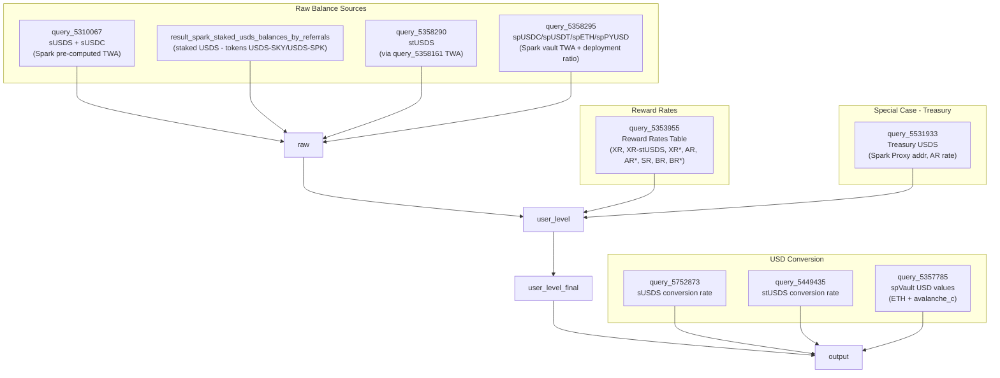

# Distribution Rewards Query Analysis (v2)

## Purpose

This document analyzes the current `xr-ar-rewards-daily-raw` Dune query against the Distribution Rewards spec (`dr-general-spec.md`), identifies gaps and ambiguities in both, and proposes a modular query architecture for iterative buildout.

**Notes on v2 vs v1.** This revision incorporates findings from the review of the `settlement-handover/` repository (see `dr-settlement-handover-review.md`). Most of the additions concern asset/chain coverage that is already operationally implemented on the Amatsu side and represents low-cost additions to our Dune roadmap:

- Three Ethereum **USDS Token Rewards Contracts** with concrete addresses (Sky Farm, Spk Farm, Chronicle).
- **sUSDS via PSM3** broadened from Base-only to a four-chain set (Base, Arbitrum, Optimism, Unichain) under one shared mechanism. *(Note: this refers to the Amatsu repo's coverage. Spark's Dune dataset covers the same chains — see correction note below.)*
- **sUSDC** broadened from Ethereum + Base to also include Arbitrum, Optimism, Unichain. *(Same note: the Spark Dune dataset also covers these chains.)*

These changes mostly land in §5 (coverage), §7 (tracking-method gaps), and §11 (architecture / iteration plan). The FIFO and rate-table discussions in §2–§4, §6, §8–§10 are unchanged from v1.

**Correction (post-v2 analysis).** An earlier version of this document incorrectly stated that Spark's opaque pre-computed dataset (`result_spark_s_usds_s_usdc_time_weighted_average_balance`, accessed via query_5310067) only covers Ethereum and Base. Live query output from query_5310067 confirms Arbitrum sUSDC (code 128 ≈ $116M) and Arbitrum sUSDS (code 128 ≈ $3.5M) are present. Base sUSDC is also confirmed. Optimism and Unichain are likely included — Spark manages this dataset for all their PSM3-deployed chains — but not yet confirmed from sample data. The gaps in §5, §7C, and §11.5 relating to L2 sUSDS and sUSDC on Dune have been updated accordingly. The outstanding gap is auditability: the dataset remains opaque, and a self-owned recreation is still needed to verify methodology.

---

## 1. Current Query Architecture

The main query assembles a `raw` CTE from four distinct data sources, then applies reward rates, 7-day rolling averages, and USD conversion.



### Sub-query roles

| Query | Role | Token(s) | Chain(s) |
|---|---|---|---|
| query_5310067 | sUSDS + sUSDC TWA balances (from Spark pre-computed dataset) | sUSDS, sUSDC | ethereum, base, arbitrum (confirmed); optimism + unichain likely — dataset is multi-chain |
| result_spark_staked_usds_balances_by_referrals | Staked USDS balances (legacy naming: USDS-SKY, USDS-SPK) | USDS-SKY, USDS-SPK | ethereum |
| query_5358290 | stUSDS TWA balances (via query_5358161) | stUSDS | ethereum |
| query_5358295 | Spark vault tokens TWA + deployment ratio | spUSDC, spUSDT, spETH, spPYUSD | ethereum, avalanche_c |
| query_5353955 | Reward rate definitions for all codes | — | — |
| query_5531933 | Spark Treasury Proxy USDS (AR reward, institutional — see §6) | USDS | ethereum |
| query_5752873 | sUSDS/sUSDC → USD conversion rate | — | ethereum |
| query_5449435 | stUSDS → USD conversion rate | — | ethereum |
| query_5357785 | spVault → USD conversion rate (includes ETH price for spETH) | — | ethereum, avalanche_c |

---

## 2. Reward Rates Currently Applied

### Rate table (from query_5353955)

| Code | Description | Rate 2024–2025 | Rate 2026+ | Type |
|---|---|---|---|---|
| XR | sUSDS, USDS-SKY, USDS-SPK | 0.60% | **0.50%** | Static (DR baseline) |
| XR-stUSDS | stUSDS | 0.60% | **0.10%** | Static |
| XR* | sUSDC, spUSDC, spUSDT, spPYUSD | 0.60% | **0.20%** | Static (Alternative) |
| AR | Agent Rate (Treasury USDS) | SSR + 0.60% | SSR + 0.20% | Dynamic |
| AR* | Agent Rate Alternative | SSR + 0.20% | **Dropped 2026** | Dynamic |
| SR | Savings Rate | SSR | SSR | Dynamic |
| BR | Base Rate | SSR + 0.30% | SSR + 0.30% | Dynamic |
| BR* | Subsidized Base Rate | (from query_6484247) | (from query_6484247) | Dynamic |
| NA | Not Applicable | 0% | 0% | Static |

### Rates used in the main query

The main query's `user_level` CTE only joins on `XR`, `XR-stUSDS`, and `XR*`. `AR`, `SR`, `BR`, `BR*`, `AR*` are defined in query_5353955 but **not referenced** in the primary token-mapping logic. The Treasury USDS query (query_5531933) joins its own rate lookup for `AR`.

### Mapping to spec formula

The spec states:
```
DR = Address Net Deposits * 0.005 / 12   (monthly)
```
This is a simple annualized-to-monthly division — 0.5% APY split evenly into 12 months.

The query computes a daily reward using:
```sql
amount / 365 * reward_per   (daily tw_reward)
```

Where `reward_per` is derived in query_5353955 as `365 * ((1 + APY)^(1/365) - 1)` — the continuously-compounded daily-rate equivalent of the target APY.

These two conventions are **approximately but not exactly equivalent.** The spec's simple-interest formula gives `0.005/12 ≈ 4.167e-4` per month. The query's daily accrual summed over 30 days gives approximately `0.004988 * 30/365 ≈ 4.10e-4` — about 1.5% lower due to the compounding convention. This divergence is small at annual timescales but could matter for payout reconciliation. Worth confirming with the spec owners which convention is the authoritative one for the payout calculation.

The spec's "base rate 0.20% + boost up to 0.30% = 0.50%" matches the XR 2026+ rate for the boosted tier.

**Concern:** `XR-stUSDS` dropped from 0.60% to 0.10% in 2026+. This is significantly below the spec's described boosted rate of 0.50%. It is unclear whether this reflects a deliberate policy decision for stUSDS specifically, or whether the spec and this rate have diverged.

---

## 3. FIFO Compliance Analysis — The Critical Gap

### What FIFO means for Distribution Rewards

The spec states:

> "On-chain Deposit Data is combined with withdrawal data to estimate net deposits associated with the Reward Code on a **FIFO basis**."

FIFO matters specifically when a single address has deposits associated with **more than one reward code**. When that address withdraws, the oldest deposit (regardless of reward code) is reduced first. This means you cannot simply track "deposits for code A" and "deposits for code B" independently — withdrawals must be applied across codes in chronological order of deposit.

### How the current query handles this

The current query **does not implement FIFO itself** — and cannot, given its shape. The `raw` CTE drops `user_addr` entirely (only `dt, blockchain, contract_address, token, ref_code, amount, amount_deployed` are selected), so all sources enter the main query already aggregated across users per `(dt, blockchain, contract_address, token, ref_code)`. Per-address ordering of deposits vs. withdrawals — the prerequisite for FIFO — has been collapsed away before the main query begins. Any FIFO logic must live **upstream**, inside the balance sources themselves, before the per-day aggregation step.

The main query relies on three upstream balance sources, each with a different level of transparency:

- `dune.sparkdotfi.result_spark_s_usds_s_usdc_time_weighted_average_balance` — sUSDS and sUSDC. Spark-owned, opaque.
- `dune.sparkdotfi.result_spark_staked_usds_balances_by_referrals` — USDS-SKY/USDS-SPK. Spark-owned, pre-aggregated (no per-user data), opaque.
- `dune.sparkdotfi.result_spark_sp_usdc_sp_usdt_sp_eth_time_weighted_average_balance` — spUSDC/spUSDT/spETH. Spark-owned, opaque.
- `query_5358161` — stUSDS. **Self-owned, fully transparent source code available.**

### Concrete FIFO gap: evidence from query_5358161 (stUSDS)

query_5358161 is the self-owned query that computes the stUSDS TWA. Reading its source reveals that ref_code attribution uses a **"last-referral-wins" model**, not FIFO:

```sql
last_value(ref_code) ignore nulls over (
    partition by blockchain, contract_address, user_addr
    order by evt_block_number asc, evt_index asc
    rows unbounded preceding
) as current_ref_code
```

This forward-fills the most recently observed referral code across all events for a user. At any point in time, the user's **entire running balance** is attributed to their most recently used ref_code. When a user deposits again with a new ref_code, the entire balance (including old deposits) shifts to the new code.

This is definitively not FIFO. FIFO would maintain separate per-ref_code buckets and deduct withdrawals from the oldest bucket first. Instead, query_5358161 implements: "whoever the user most recently tagged, gets credit for the full balance."

This is not a code error — it is an implementation choice. The stUSDS contract fires a separate `stusds_evt_referral` event in the same transaction as each deposit. query_5358161 matches this event to the accompanying Transfer by `evt_tx_hash` to get the per-deposit ref_code, then forward-fills it across subsequent events using `last_value`. The query then assigns the user's **entire running balance** to whatever ref_code was most recently seen, rather than maintaining separate per-tranche balances.

**FIFO is not impossible for stUSDS.** The on-chain data required for FIFO is present: each deposit with a referral code has a `stusds_evt_referral` event in the same transaction, so per-deposit ref_code is recoverable. Withdrawals carry no ref_code (only a Transfer event), but FIFO handles exactly this: attribute the withdrawal to the oldest deposit regardless of its ref_code. The algorithm would be: build a per-user ordered list of `(timestamp, ref_code, shares)` deposit tranches matched from `stusds_evt_referral`; on each withdrawal, reduce from the front.

The architectural difference from sUSDS is that for stUSDS the per-deposit ref_code requires a `tx_hash` join to `stusds_evt_referral`, while for sUSDS the `referral` parameter is embedded directly in the `susds_evt_deposit` event. Both are available from on-chain data and both support FIFO. query_5358161 chose last-referral-wins for simplicity — or possibly by deliberate design intent. See the methodology ambiguity discussion below.

For the Spark pre-computed sUSDS/sUSDC and sp* datasets, the question remains open — but the sUSDS/sUSDC dataset outputs an **identical schema** to query_5358161, suggesting it may have been built using the same methodology and therefore also uses last-referral-wins attribution.

### Methodology ambiguity: is FIFO actually the correct model?

The spec is explicit — it says FIFO. But there are substantive reasons to question whether FIFO is achievable, or even the intended interpretation, across all tracked assets. **This has not been resolved and should be clarified with whoever owns the spec before building a new FIFO layer.**

**Arguments that last-referral-wins may be the intended model in practice:**

1. **The existing stUSDS query uses last-referral-wins, and this may reflect deliberate intent.** The stUSDS contract fires referral codes as separate events (`stusds_evt_referral`) in the same transaction as each deposit. query_5358161 uses this to get the per-deposit ref_code, but then assigns the user's entire balance to the most recent ref_code rather than tracking per-tranche. This choice may reflect a deliberate product decision: "whoever the user most recently tagged should receive full credit going forward." If that is the intent, the query is correct and FIFO would be wrong to implement.

2. **Last-referral-wins satisfies the anti-double-counting rule.** The spec's only hard constraint is: "no possibility that the same USDS balance is double counted for multiple reward codes." Last-referral-wins satisfies this — at any point in time the entire balance is attributed to exactly one ref_code. FIFO also satisfies it, but last-referral-wins is sufficient for the stated requirement.

3. **Integrator intent may favour last-referral-wins.** If a user re-registers with a new integrator's ref_code, the natural expectation may be that the new integrator earns DR on the user's full balance going forward — not just on the marginal new deposit. Last-referral-wins produces this outcome; FIFO does not.

4. **The spec formula is balance-based, not tranche-based.** `DR = Address Net Deposits * .005 / 12` operates on a single net balance figure per address, which is consistent with a single active ref_code per address at a time (last-referral-wins) rather than a split across multiple simultaneously active codes (FIFO).

**Arguments that FIFO is necessary:**

1. **The spec text is unambiguous.** "FIFO basis" is stated directly and is the plain-text interpretation.

2. **Last-referral-wins creates a gaming vector.** Without FIFO, an integrator could re-tag an existing large balance (by having the user submit a new referral transaction) to claim DR credit without actually attracting new deposits. FIFO prevents this: a re-tag only affects future deposits; old deposits remain attributed to their original code until they are withdrawn.

3. **FIFO correctly handles integrator churn.** If a user switches from integrator A to integrator B and later withdraws, FIFO ensures the withdrawal reduces the oldest position first — which may still belong to A. Under last-referral-wins, A loses all attribution immediately on the re-tag, even before any withdrawal occurs.

### Is last-referral-wins uniformly applied across the current query?

**No — and this is important.** Last-referral-wins is only confirmed for one of the four balance sources. The others are either opaque or structurally different.

| Source | Attribution model | Certainty | Reason |
|---|---|---|---|
| stUSDS (query_5358161) | Last-referral-wins | **Confirmed** | Source code readable; `last_value` forward-fill explicit |
| sUSDS/sUSDC (Spark dataset A) | Unknown | **Opaque** | Spark-owned; same output schema as query_5358161 is circumstantial only |
| sp* vaults (Spark dataset B) | Unknown | **Opaque** | Same uncertainty as dataset A |
| Staked USDS (Spark dataset C) | Not applicable | N/A | Pre-aggregated; only ref_code 99 seen in samples; no multi-code attribution possible |
| Treasury USDS (query_5531933) | Not applicable | N/A | Single ref_code (126); no attribution question |

**A structural distinction exists between stUSDS and sUSDS/sp* vaults, but it does not affect FIFO feasibility.** For stUSDS, the per-deposit ref_code is obtained by joining a separate `stusds_evt_referral` event on `tx_hash`. For sUSDS and sp* vault tokens, the `referral` parameter is embedded directly in the deposit event. In both cases, the per-deposit ref_code is recoverable from on-chain data, and FIFO is technically implementable for all of them. The difference is one of query complexity, not possibility.

Therefore:
- FIFO is technically achievable for sUSDS, stUSDS, and sp* vault tokens alike.
- Whether the Spark pre-computed datasets implement FIFO or last-referral-wins for sUSDS and sp* vaults is still unknown.
- If the spec's intent is FIFO, self-owned recreations can and should implement it.
- If the intent is last-referral-wins, the self-owned recreations should mirror the `last_value` forward-fill pattern from query_5358161.

**The current query is likely inconsistent:** stUSDS uses confirmed last-referral-wins; the Spark sUSDS/sUSDC and sp* datasets may use a different model. This inconsistency should be resolved as part of the recreation work.

### FIFO risk scenarios

**Scenario A — Multi-code same address:**
Address deposits 100 USDS → sUSDS with ref_code 100, then deposits 50 USDS → sUSDS with ref_code 200. Address withdraws 80 USDS. Under FIFO, ref_code 100's attribution should go from 100 to 20 (the 80 comes from the earliest deposit). If Spark's dataset does not implement this, both codes would be overstated.

**Scenario B — Token migration:**
Address holds USDS-SKY (tracked in `result_spark_staked_usds_balances_by_referrals`). The token is migrated/renamed to stUSDS. The query currently has both `result_spark_staked_usds_balances_by_referrals` and `query_5358290` (stUSDS) unioned into `raw`. If the same underlying balance is tracked in both, this is **double-counting**. This is a concrete, verifiable risk.

**Scenario C — CoW Swap then re-deposit:**
Detailed in Section 7 below.

### Recommendation

- **Resolve the methodology question first.** Before rebuilding any of the balance sources, confirm with spec owners whether FIFO or last-referral-wins is the intended model. The choice has architectural implications: FIFO requires per-tranche accounting; last-referral-wins requires only a running balance with a forward-filled ref_code. Building the wrong one means reworking the core computation.
- **stUSDS**: confirmed last-referral-wins in query_5358161, as an implementation choice — not a contract impossibility. FIFO is implementable for stUSDS using the same `tx_hash` join to `stusds_evt_referral` already present in the query.
- **sUSDS/sUSDC**: methodology unknown (opaque Spark dataset), but FIFO is technically achievable due to per-deposit ref_code in the event. Self-owned recreation should implement whichever model is confirmed correct.
- **sp* vaults**: same as sUSDS.
- **staked USDS**: not assessable (pre-aggregated). If only ref_code 99 is ever present, the question is moot for this source.
- The overlap between `result_spark_staked_usds_balances_by_referrals` and `query_5358290` (stUSDS) requires date-range verification (see §6).

---

## 4. Spark Pre-Computed Dataset Analysis and Recreation Plan

The main query depends on four Spark-owned pre-computed datasets. Removing these dependencies is necessary for auditability, FIFO verification, and long-term stability. Below is an analysis of each, with a self-owned reference implementation now available for stUSDS.

### Dataset inventory

| Dataset | Via query | Schema type | Chains | Opaque? |
|---|---|---|---|---|
| `result_spark_s_usds_s_usdc_time_weighted_average_balance` | query_5310067 | Per-user, with segment fields | ethereum, base, arbitrum (confirmed); optimism + unichain likely | Yes |
| `result_spark_sp_usdc_sp_usdt_sp_eth_time_weighted_average_balance` | query_5358295 | Per-user, with segment fields (identical schema) | ethereum, avalanche_c | Yes |
| `result_spark_staked_usds_balances_by_referrals` | raw CTE | Pre-aggregated, no segment fields | ethereum | Yes |
| `result_spark_savings_v_2_vaults_time_weighted_average_holdings` | query_6398769 | Unknown (used for deployment ratio) | unknown | Yes |

Additionally, `query_5358161` (stUSDS TWA) is a **self-owned query** that is already fully transparent — it does not depend on any Spark dataset. See below.

---

### Dataset A — result_spark_s_usds_s_usdc_time_weighted_average_balance

**Schema** (from sample data):

| Column | Notes |
|---|---|
| blockchain | `ethereum`, `base`, `arbitrum` confirmed in live data; `optimism`, `unichain` likely |
| contract_address | sUSDS or sUSDC contract |
| user_addr | Depositor's wallet |
| dt | Calendar day |
| ref_code | Referral code; `-999999` = untagged |
| symbol | `sUSDS` or `sUSDC` |
| time_weighted_avg_balance | Daily TWA in token units |
| day_type | `transaction_day` or `no_transaction_day` |
| segment_duration_seconds | Present only on `transaction_day` rows |
| segment_balance_time_product | Present only on `transaction_day` rows |

**Key findings:**
- TWA formula verified: `time_weighted_avg_balance = segment_balance_time_product / 86400`
- **Covers multiple chains** — not just Ethereum + Base as previously documented. Live query results confirm Arbitrum sUSDC (`0x940098b108fb7d0a7e374f6eded7760787464609`, code 128 = ~$116M) and Arbitrum sUSDS (`0xddb46999f8891663a8f2828d25298f70416d7610`, code 128 = ~$3.5M). Base sUSDC (`0x3128a0f7f0ea68e7b7c9b00afa7e41045828e858`) also confirmed. Optimism and Unichain are likely included given Spark manages this dataset for all their deployed PSM3 chains, but not yet confirmed from sample data.
- Known confirmed contracts: Ethereum sUSDS `0xa3931d71877c0e7a3148cb7eb4463524fec27fbd`, Ethereum sUSDC `0xbc65ad17c5c0a2a4d159fa5a503f4992c7b545fe`, Base sUSDC `0x3128a0f7f0ea68e7b7c9b00afa7e41045828e858`, Arbitrum sUSDC `0x940098b108fb7d0a7e374f6eded7760787464609`, Arbitrum sUSDS `0xddb46999f8891663a8f2828d25298f70416d7610`
- **Data quality note:** Arbitrum sUSDS rows include some malformed ref_codes (`123623963915635`, `90000000000000000000`) with tiny amounts (~$17, ~$8.59). These are likely PSM3 `referralCode` bytes32 fields parsed incorrectly for a small subset of Swap events. Amounts are negligible but should be filtered when joining on ref_code.
- query_5310067 reclassifies ref_code `-999999` → 99 (sUSDS) or 127 (sUSDC)
- ref_code attribution methodology: unknown (opaque), but the output schema is identical to query_5358161 (stUSDS), which uses last-referral-wins. Likely the same approach.

---

### Dataset B — result_spark_sp_usdc_sp_usdt_sp_eth_time_weighted_average_balance

**Schema**: Identical to Dataset A — same columns including `segment_duration_seconds` and `segment_balance_time_product`, same `day_type` pattern. Same TWA formula applies.

**Key findings:**
- Sample data shows **only Avalanche C** (`avalanche_c`), confirming Avalanche C spUSDC is actively live and tracked — this is not just a pricing artifact.
- Contract `0x28b3a8fb53b741a8fd78c0fb9a6b2393d896a43d` on Avalanche C = spUSDC vault
- ref_code 128 appears in the sample (active, non-default referral code)
- Full dataset likely includes Ethereum spUSDC/spUSDT/spPYUSD as well (confirmed by query_5358295's Ethereum contract references)
- Recreation approach is the same as Dataset A — same schema, same methodology

**Relationship with deployment ratio (query_6398769):**
The deployment ratio query uses this dataset as the `vault_total_supply` source and subtracts `vault_idle_holdings` from a **fifth Spark dependency**: `result_spark_savings_v_2_vaults_time_weighted_average_holdings`. This means replacing Dataset B also requires replacing the deployment ratio source. The deployment ratio represents the fraction of vault assets actually deployed into lending markets, used as the reward base for spUSDC/spUSDT/spPYUSD (but not spETH, which is excluded).

---

### Dataset C — result_spark_staked_usds_balances_by_referrals

**Schema** (from sample data):

| Column | Notes |
|---|---|
| dt | Calendar day |
| blockchain | `ethereum` only (in sample) |
| contract_address | `0xdc035d45d973e3ec169d2276ddab16f1e407384f` (USDS token contract) |
| token | `USDS-SKY` (only symbol in sample; USDS-SPK absent) |
| ref_code | Aggregated referral code |
| amount | Total balance (sum across users — NOT per-user) |

**Key findings:**
- **Fundamentally different schema** from Datasets A and B — there are no `user_addr`, `segment_duration_seconds`, `segment_balance_time_product`, or `day_type` fields. This is a pre-aggregated total, not a per-user computation. FIFO cannot be verified or implemented from this dataset.
- The contract address `0xdc035d45d973e3ec169d2276ddab16f1e407384f` is the **USDS token contract itself**, not a savings or staking contract. This dataset tracks aggregate USDS token balances associated with the SKY rewards staking mechanism, where the referral code is registered externally.
- **All sample rows show ref_code 99** (the reclassified default). No other ref_codes appear in the available sample — it is unclear whether the full dataset contains other codes.
- **USDS-SPK is absent** from the sample. It is unknown whether USDS-SPK rows exist in the full dataset with a different date range, or whether USDS-SPK tracking was never implemented here.
- **Amounts are declining sharply**: ~484M USDS in Sept 2024 → ~19M by Dec 2025. This ~97% decline over 15 months is consistent with users migrating from SKY-rewards USDS staking to the newer stUSDS contract (`0x99CD4Ec`, active from Aug 2025). The two overlap for approximately Aug–Dec 2025.
- Latest sample date is Dec 2025 — this dataset may be approaching end-of-life as migration completes.

**Double-counting risk (Scenario B):** During the Aug–Dec 2025 overlap window, both this dataset and query_5358290 (stUSDS) are active simultaneously. If users migrated by withdrawing from the old SKY staking and depositing into stUSDS (two separate on-chain events), the same underlying USDS is counted in both datasets during the transition period only if their old stake was not yet withdrawn. A guard `WHERE dt < cutover_date` on this dataset — once the migration is confirmed complete — would eliminate any residual overlap.

---

### Reference implementation — query_5358161 (stUSDS, self-owned)

query_5358161 is a **fully self-owned, transparent query** that computes stUSDS TWA balances from raw on-chain events. It does not depend on any Spark dataset and its source code is available. It demonstrates the standard pattern for TWA computation from raw transfers and should serve as the reference implementation for recreating Datasets A and B.

**Methodology:**
1. Sources `sky_ethereum.stusds_evt_referral` for referral code events (separate from the transfer event)
2. Sources `sky_ethereum.stusds_evt_transfer` for all balance changes (incoming = positive, outgoing = negative)
3. Computes running balance per `(user_addr, contract_address)` ordered by block/event index
4. Forward-fills the most recent referral code using `last_value(ref_code) IGNORE NULLS` — this is the **last-referral-wins** attribution model
5. Computes daily TWA segments: `sum(running_balance × duration_seconds) / 86400`
6. Forward-fills balance on no-transaction days

The output schema is **identical** to Dataset A (same columns, same segment fields, same day_type). This confirms that recreating Dataset A follows the same computational pattern as query_5358161 — the only difference is sourcing `sky_ethereum.susds_evt_referral` and `sky_ethereum.susds_evt_deposit/withdraw` instead of the stUSDS equivalents.

Note: for sUSDS, the referral code IS embedded in the deposit event (`sky_ethereum.susds_evt_deposit` has a `referral` parameter), unlike stUSDS where the referral fires as a separate event. This means sUSDS recreation can directly read the ref_code from the deposit event, which is architecturally cleaner than the stUSDS approach.

---

### Why removing these dependencies matters

- **FIFO auditability:** Cannot verify FIFO compliance in opaque Spark datasets; recreation enables direct inspection
- **Stability:** Query breaks silently if Spark deprecates or changes any dataset
- **Extensibility:** Self-owned queries can add missing chains and verify FIFO compliance without waiting on Spark
- **Correctness baseline:** Recreated queries can be compared row-by-row against Spark outputs to confirm or reveal discrepancies

### Recommended recreation order

1. **Ethereum sUSDS** — most volume, cleanest ref_code in deposit event, reference pattern from query_5358161
2. **Ethereum sUSDC** — same pattern, requires identifying Spark sUSDC deposit/withdraw event tables
3. **Base sUSDC** — same pattern as Ethereum, different chain event tables
4. **sp vault tokens** — same schema as A/B, requires identifying Spark vault deposit/withdraw event tables for each chain
5. **Deployment ratio** — once sp vault recreation is complete, replace `result_spark_savings_v_2_vaults_time_weighted_average_holdings` dependency in query_6398769

---

## 5. Asset, Chain, and Reward Code Coverage

### Assets

| Asset | Spec Mentions | Query Covers | Notes |
|---|---|---|---|
| USDS (direct, SSR / Token Rewards Contracts) | Yes (general tracking) | Partial — Treasury (AR code) + Sky Farm aggregate via opaque dataset | Three concrete on-chain Token Rewards Contracts are publicly known and documented in `dr-settlement-handover-review.md §6.1`: Sky Farm `0x0650CAF1...` (USDS → SKY emissions), Spk Farm `0x173e314C...` (USDS → SPK), Chronicle `0x10ab606b...` (USDS → CLE). Sky Farm's underlying USDS is partially surfaced via `result_spark_staked_usds_balances_by_referrals` (aggregate-only, opaque). Spk Farm and Chronicle are not surfaced anywhere on the Dune side. All three are SNX-style `StakingRewards` clones with `Staked`/`Withdrawn`/`Referral` events. See §11.5 Step 5. |
| sUSDS | Yes | Yes (XR) | via query_5310067 |
| stUSDS | Yes | Yes (XR-stUSDS) | via query_5358290 |
| sUSDC | Implicit (XR* alternative) | Yes (XR*) | Spark alternative tracking |
| spUSDC | Implicit (alternative) | Yes (XR*) | Spark vault alternative |
| spUSDT | Implicit (alternative) | Yes (XR*) | Spark vault alternative |
| spETH | Implicit (alternative) | **No DR rewards** | `amount_deployed` is hardcoded to 0 in query_5358295; spETH earns no distribution rewards. Intentional. |
| spPYUSD | Implicit (alternative) | Yes (XR*) | Spark vault alternative |
| USDS-SKY | Not in spec | Yes (XR) | Likely deprecated naming for staked USDS |
| USDS-SPK | Not in spec | Yes (XR) | Likely deprecated naming for staked USDS |

**Key gap:** The spec says USDS can be tracked directly via general on-chain tracking (deposits into SSR contract or Token Rewards Contracts). The query only tracks the derivative tokens (sUSDS, stUSDS) or a single hardcoded Treasury address. General USDS holding tracked via reward code parameters (not yet in a savings contract) is absent. Sky Farm, Spk Farm, and Chronicle (all on Ethereum) are concrete Token Rewards Contracts that should be tracked as part of closing this gap; see §7A and §11.5 Step 5.

### Chains

The spec does not enumerate all chains exhaustively. The table below reflects what is known to be active or needed based on query analysis and data inspection. New chains are expected to be added as Spark Protocol expands.

| Chain | Asset(s) | Mechanism | Coverage status | What's needed |
|---|---|---|---|---|
| Ethereum | sUSDS, sUSDC | SSR deposit events (ref_code in deposit) | Active — Spark pre-computed dataset (opaque) | Recreate self-owned (see §4 Dataset A) |
| Ethereum | stUSDS | Token Rewards Contract transfer + referral events | Active — self-owned (query_5358161) | Complete; serves as reference implementation |
| Ethereum | spUSDC, spUSDT, spPYUSD | Spark vault ERC4626 events | Active — Spark pre-computed dataset (opaque) | Recreate self-owned (see §4 Dataset B) |
| Ethereum | spETH | Spark vault ERC4626 events | Tracked, zero DR rewards | Intentional; no action needed |
| Ethereum | USDS (Sky Farm, Spk Farm, Chronicle) | Synthetix-style `StakingRewards` clones — `Staked`/`Withdrawn`/`Referral` events | Sky Farm partially covered via opaque aggregate dataset; Spk Farm and Chronicle **not covered** | Build self-owned per-contract event query — see §7A and §11.5 Step 5 |
| Base | sUSDC | Spark sUSDC deposit/PSM events | Active — Spark pre-computed dataset (opaque), confirmed in sample | Include in Dataset A recreation |
| Base, Arbitrum, Optimism, Unichain | sUSDS via PSM3 | PSM3 contract `Swap` event with `referralCode` parameter inline (USDS/USDC → sUSDS) | **Covered by Spark dataset** — Arbitrum sUSDS confirmed live (code 128 ≈ $3.5M in sample); Base, Optimism, Unichain likely included | Recreation: build self-owned multi-chain PSM3 tracker to verify and replace opaque coverage. See §7C and §11.5 Step 3. |
| Arbitrum, Optimism, Unichain | sUSDC | ERC4626 deposit/withdraw + `Referral` event (same template as Ethereum/Base sUSDC) | **Covered by Spark dataset** — Arbitrum sUSDC confirmed live (code 128 ≈ $116M in sample); Optimism + Unichain likely included | Recreation: verify self-owned coverage matches. sUSDC contract addresses in `dr-settlement-handover-review.md §6.1`. See §11.5 Step 1b. |
| Avalanche C | spUSDC | Spark vault ERC4626 events | Active — Spark pre-computed dataset (opaque); ref_code 128 confirmed live | Include Avalanche C in Dataset B recreation alongside Ethereum |
| CoW Swap | sUSDS (and others) | Solver network events | **Not implemented** | Build isolated CoW Swap query (see §8) |

### Reward Codes

| Code | query_5353955 | Main query uses | Notes |
|---|---|---|---|
| XR | Defined | Yes | Primary DR code for sUSDS |
| XR-stUSDS | Defined | Yes | DR code for stUSDS |
| XR* | Defined (expires 2026) | Yes | Alternative DR for Spark vaults |
| AR | Defined | Yes (Treasury only) | Not a DR code per spec; this is Agent Rate / institutional |
| AR* | Defined (drops 2026) | No | Was alternative Agent Rate; expired |
| SR | Defined | No | Savings Rate; not a DR code |
| BR | Defined | No | Base Rate; used for borrowing, not DR |
| BR* | Defined | No | Subsidized Base Rate; not a DR code |

**Gap:** The main query's `raw` CTE pulls time-weighted balances but does not filter for which ref_codes map to which reward codes at the data ingestion level. Any new DR reward codes would need to be manually added to the token-to-reward-code mapping in `user_level`.

---

## 6. Legacy and Extraneous Elements

### `referral_type` classification

The `user_level` CTE classifies rows as either `'Spark referrals'` or `'non-Spark referrals'` based on:
- Token type (sUSDC/spUSDC/spUSDT/spPYUSD → Spark referrals)
- spETH → non-Spark referrals
- ref_code 100–999 → Spark referrals
- everything else → non-Spark referrals

This classification is **not present in the spec**. It appears to be an internal Spark operational distinction — likely used to separate Spark's own referral codes from external integrators. For a general Distribution Rewards query, this classification is extraneous and may create confusion. It should either be documented as an operational annotation or removed in a cleaned foundation layer.

### USDS-SKY and USDS-SPK tokens

In `user_level_final`, these are remapped to `stakedUSDS`:
```sql
when token in ('USDS-SPK', 'USDS-SKY') then 'stakedUSDS'
```

From the `result_spark_staked_usds_balances_by_referrals` sample data, we can now be more specific:

- **USDS-SKY only** appears in the dataset sample. USDS-SPK does not appear — it may not exist in the full dataset, or may not have been implemented.
- **Contract `0xdc035d45d973e3ec169d2276ddab16f1e407384f`** is the USDS token contract — this tracks USDS balances staked in the SKY rewards mechanism, not a separate derivative token.
- **All sample rows show ref_code 99** (default/untagged). No named ref_codes appear.
- **Sharp balance decline**: ~484M USDS (Sept 2024) → ~19M USDS (Dec 2025). The stUSDS contract launched at 2025-08-25 (per query_5358161's `start_date`). The USDS-SKY amounts decline rapidly from that point, consistent with users migrating.
- **Overlap window**: Aug–Dec 2025. Both USDS-SKY and stUSDS are simultaneously active. The double-counting risk is real during this window: a user who migrated gradually could appear in both datasets on the same day. The aggregate-only schema of the staked USDS dataset makes it impossible to de-duplicate at the user level from this source alone.
- **USDS-SPK**: Absent from the dataset, possibly never tracked here or tracked under a different mechanism. The `USDS-SPK` symbol in the main query's `user_level_final` may be a dead branch that never actually produces rows.

**Recommended action:** Add a `WHERE dt < '2025-08-25'` guard on the `result_spark_staked_usds_balances_by_referrals` source to exclude the overlap window, since the stUSDS query (query_5358290 via query_5358161) takes over from that date. Verify that the USDS-SKY amounts reach near-zero by this date or soon after to confirm clean handoff.

### AR* reward code

Defined in query_5353955 but dropped after 2026-01-01. Not used in the main query. Likely a transitional rate. Safe to treat as deprecated for new work.

### XR* reward code

Defined through 2030 but represents Spark-specific alternative tracking (sUSDC, spTokens). As Spark vaults may change, this code may lose applicability over time. The 2026+ rate of 0.20% is below the spec's described boosted maximum, suggesting it may represent a different (lower) tier for alternative-method assets.

### Treasury tracking (query_5531933) — institutional, likely out of scope for DR

query_5531933 tracks USDS held at a single hardcoded address: **`0x3300f198988e4C9C63F75dF86De36421f06af8c4`**, described as the "Spark Proxy (Treasury)." This is the Spark Protocol's own treasury/proxy contract — not a user or integrator address. Spark as a Prime Agent earns the AR (Agent Rate = SSR + spread) on USDS managed through this contract. This is institutional reward tracking for Spark itself, distinct from Distribution Rewards to integrators. The AR reward code is SSR-based and does not correspond to the fixed XR rates described in the DR spec.

This query is likely **not in scope** for a general DR tracking system and should either be moved to a separate Spark-internal institutional tracking query or clearly labelled as such. It should not influence the design of the DR foundation layer.

---

## 7. Tracking Method Gap Analysis

The spec defines four tracking methodologies. Current query coverage:

### A. ETH Mainnet General Tracking (spec §2.2.8.1.2.1.2.2.1)

Mechanism: reward code as parameter to SSR deposits or Token Rewards Contract deposits.

- **sUSDS tracking**: Covered via Spark's pre-computed TWA dataset (query_5310067). FIFO status unknown.
- **stUSDS tracking**: Covered via query_5358290. FIFO status unknown.
- **Direct USDS tracking**: Only covered for one hardcoded Treasury address (query_5531933 with AR code). No general per-address USDS tracking for DR codes.
- **Token Rewards Contracts (per-user, with referral)**: Three concrete contracts on Ethereum are publicly identified and operationally tracked by the Amatsu pipeline (per `dr-settlement-handover-review.md §6.1`):
  - **Sky Farm** at `0x0650CAF159C5A49f711e8169D4336ECB9b950275` (Etherscan: "Sky: Staking Reward") — USDS staking with SKY emissions.
  - **Spk Farm** at `0x173e314C7635B45322cd8Cb14f44b312e079F3af` (Etherscan: "Sky: USDS to SPK Farm (StakingRewards)") — USDS staking with SPK emissions.
  - **Chronicle** at `0x10ab606b067c9c461d8893c47c7512472e19e2ce` — USDS staking with Chronicle (CLE) points.
  All three are SNX-style `StakingRewards` clones with the same `Staked`/`Withdrawn`/`Referral` event signature, so a single per-user attribution template covers all three (parameterized by contract address). Sky Farm's underlying USDS is partially surfaced via `result_spark_staked_usds_balances_by_referrals` at aggregate level only (no `user_addr`); Spk Farm and Chronicle are not surfaced anywhere on the Dune side. The `USDS-SPK` symbol that appears in the main query alongside `USDS-SKY` is a dead branch — the underlying dataset never emits rows for it.

**Gap:** If a protocol deposits USDS directly into a Token Rewards Contract with a DR reward code (without converting to sUSDS or stUSDS), that balance is not tracked except via the single Treasury address special case. The three contracts above are the highest-priority targets for closing this gap (see §11.5 Step 5). A fully general approach (any USDS held in any Token Rewards Contract with a DR ref_code) remains a longer-tail goal.

### B. CoW Swap Tracking (spec §2.2.8.1.2.1.2.2.2)

Mechanism: same FIFO net deposit logic, but tracked on CoW Swap's solver network events.

- **Status: Not implemented.** No CoW Swap data source exists in the current query.
- See Section 8 for the specific FIFO interaction problem.

### C. Base Tracking (spec §2.2.8.1.2.1.2.2.3) — and PSM3 across L2s

Mechanism: reward codes as parameters in Base PSM contract calls; USDS/USDC → sUSDS conversions count as deposits. The same mechanism is now live on three additional L2s under the `PSM3` contract family.

- **Broadly covered by Spark dataset (corrected).** The Spark pre-computed dataset `result_spark_s_usds_s_usdc_time_weighted_average_balance` is **not limited to Ethereum + Base** as previously documented. Live query results from query_5310067 confirm: Base sUSDC at `0x3128a0f7f0ea68e7b7c9b00afa7e41045828e858`, Arbitrum sUSDC at `0x940098b108fb7d0a7e374f6eded7760787464609` (code 128 ≈ $116M), and Arbitrum sUSDS at `0xddb46999f8891663a8f2828d25298f70416d7610` (code 128 ≈ $3.5M). This means PSM3-acquired sUSDS on L2s **is** flowing through query_5310067 into the main Dune query. Optimism and Unichain are likely also present but not yet confirmed from sample data.
- **Data quality note on Arbitrum sUSDS.** A small number of Arbitrum sUSDS rows carry malformed ref_codes (e.g. `123623963915635`, `90000000000000000000` — almost certainly bytes32 PSM3 `referralCode` fields not decoded to uint32). Amounts are negligible (~$17–$26 total) but will cause join failures in any reconciliation report that groups on `ref_code` as an integer. These should be filtered or coerced.
- **Remaining gap: self-owned recreation.** The Spark dataset is opaque; its methodology (FIFO vs. last-referral-wins) and exact event source (PSM3 `Swap` events vs. direct sUSDS/sUSDC deposit events) cannot be verified without a self-owned replacement. A single multi-chain PSM3 tracker parameterized by chain + PSM3 contract + sUSDS token would achieve this. See §11.5 Step 3.
- **sUSDC on Arbitrum, Optimism, Unichain** is also covered by the same Spark dataset (confirmed for Arbitrum). Self-owned recreation follows the same Ethereum sUSDC template (see §11.5 Step 1b).
- **No price/conversion support for Base sUSDS or any L2 sUSDS.** The conversion rate queries (query_5752873, query_5357785) are Ethereum-only. Per-chain conversion rate sources will be needed for sUSDS on Base/Arbitrum/Optimism/Unichain. (sUSDC on L2s can continue to share the sUSDS conversion rate per the simplification in §9.2.2.)

### D. Alternative Tracking Methods (spec §2.2.8.1.2.1.2.2.4)

Mechanism: Prime Agents can propose custom tracking methods provided they: use FIFO net deposit basis; prevent double-counting across reward codes; use independently verifiable on-chain or off-chain data.

- The Spark vault tokens (spUSDC, spUSDT, spPYUSD) with XR* reward code appear to be an instance of this — they are tracked via a Spark-specific dataset rather than standard SSR deposit parameters. The `amount_deployed` field (from `query_5358295`) applies a deployment ratio, which is specific to Spark's vault accounting.
- **spETH is explicitly excluded from DR rewards.** In query_5358295, `amount_deployed` is hardcoded to `0` for spETH, meaning its reward base is always zero. spETH appears in the query for tracking/display purposes only. This is intentional.
- The Treasury tracking (query_5531933) is likely another alternative method instance, but is probably out of scope for DR (see §6).
- **FIFO compliance of these alternative methods is unverified.**

---

## 8. CoW Swap Tracking and FIFO Interaction Problem

### Why CoW Swap is different

CoW Swap is a decentralized exchange where trades are settled via solver batches. The tracking methodology in the spec requires tagging solver network events with reward codes. Unlike SSR or Token Rewards Contracts, CoW Swap does not natively accept a reward code parameter — the tracking must come from solver event metadata or a side-channel registration mechanism.

### The cross-stream attribution problem

It is important to be precise about what the cross-stream problem actually is. It is **not** that the same balance would be counted twice at the balance level — the sUSDS balance tracker (Layer 0 entry `eth_susds_events`) already sees every incoming and outgoing sUSDS transfer on-chain, regardless of how the user acquired the sUSDS. CoW Swap cannot "add" to this balance count; the underlying ERC20 transfer is already observed.

The real problem is **ref_code attribution conflict**. When a user receives sUSDS via a CoW Swap swap, the sUSDS contract sees only a Transfer event with no accompanying deposit/referral event (because the swap happens outside the sUSDS deposit flow). Under last-referral-wins, the tracker attributes that incoming sUSDS to the user's last-known ref_code — possibly `-999999` (untagged) or some older ref_code. Meanwhile, CoW Swap's solver event carries a different ref_code for the same acquisition.

Consider this scenario:

1. At T1, address A deposits 100 USDS → sUSDS via the sUSDS contract with ref_code `XR-001`. Tracker attributes balance to `XR-001`.
2. At T2, address A acquires 50 sUSDS via CoW Swap, tagged with ref_code `XR-002` in the solver event. The sUSDS tracker sees a 50-unit Transfer in but no referral event — balance stays attributed to `XR-001` (under last-referral-wins).
3. Now there are two conflicting claims on that 50 sUSDS: the sUSDS tracker says `XR-001`, the CoW Swap tracker says `XR-002`.

Under FIFO, the conflict is even sharper: the sUSDS tracker sees the 50-unit Transfer as an untagged addition (no referral event), while CoW Swap asserts its own ref_code attribution for the same tokens.

**This is the cross-stream problem:** two data streams make different ref_code claims on the same share balance. Resolving it requires:

- The on-chain sUSDS tracker to *defer* ref_code attribution for incoming Transfers that lack a corresponding deposit/referral event, to avoid claiming them
- The CoW Swap tracker to *supply* ref_code attribution for exactly those cases
- A merge mechanism that reconciles the two, ideally by tagging each incoming Transfer with its origin (sUSDS deposit event? CoW Swap solver event? something else?) at acquisition time

This is achievable but requires the on-chain tracker to be redesigned as a "known-attribution" vs. "external-attribution" split rather than a single forward-filled ref_code per user.

### Practical near-term approach

Until a unified cross-stream attribution layer exists:

1. **Build CoW Swap tracking as its own isolated query.** It produces per-address, per-ref_code attribution claims for acquisitions that happened via CoW Swap.
2. **Do not UNION CoW Swap claims into the balance trackers.** The balance is already in the sUSDS (or equivalent) tracker. Only the ref_code attribution claim is unique to CoW Swap.
3. **Flag conflicts explicitly.** For any (address, date) where the CoW Swap tracker and the sUSDS tracker both assert a non-default ref_code, emit a conflict row for manual review or explicit resolution rules.
4. **Leave precedence unresolved in V1.** Whether CoW Swap ref_code or sUSDS contract ref_code takes precedence when they conflict is a policy question — not a query question. Surface the conflicts; resolve them by policy decision.
5. **Treat unified cross-stream attribution as a V2 milestone.** This requires the on-chain tracker to be rebuilt as a "known-attribution / external-attribution" split with explicit deferral for externally-attributed Transfers.

---

## 9. Known Issues in the Current Query

This section collects the findings from re-analyzing the main query. Each issue is tagged with how it is addressed in the rebuild plan (§11) and which open question (§10) it depends on, if any. Items are grouped by whether they affect the architecture shape, the reward computation semantics, or only the output presentation.

### 9.1 Architectural constraints carried forward from the current query

**9.1.1 FIFO must happen upstream of the `raw` CTE (architectural hard constraint)**

The main query's `raw` CTE drops `user_addr` — it selects only `(dt, blockchain, contract_address, token, ref_code, amount, amount_deployed)`. All four upstream sources enter the main query already aggregated across users per `(dt, blockchain, contract_address, token, ref_code)`. Per-address ordering of deposits vs. withdrawals — the prerequisite for FIFO — has been collapsed away before the main query begins.

This means every FIFO implementation path lives inside the balance-source queries (query_5310067, query_5358290, query_5358295, and any self-owned recreations) — not in the main query. In the rebuild plan, this constraint shapes the Layer 1 (Attribution) entries: they must produce FIFO-correct per-ref_code balances at the per-user level, and only aggregate across users at Layer 2.

This same finding also anchors the FIFO discussion in §3.

→ *Addressed in §11 by the layer structure (§11.2) and the resolution dependency on Q1 (§10).*

**9.1.2 No monthly aggregation layer for DR payout**

The spec's DR formula is monthly: `DR = amount * 0.005 / 12`. The query produces daily `tw_reward` rows and a 7-day rolling average, but no monthly rollup. For dashboard purposes this is fine; for an authoritative payout calculation, a monthly aggregation step is required.

Two candidate implementations for the rebuilt architecture:
- Sum daily `tw_reward` within a calendar month
- Compute monthly TWA balance directly and multiply by the monthly rate

These are equivalent under the simple-interest convention the spec uses, but differ slightly under the compounded convention query_5353955 currently uses. The resolution depends on Q9 (authoritative payout convention — see §10).

→ *Addressed in §11 by adding a monthly aggregation step to the layer structure (§11.2), with the exact formula determined by Q9.*

### 9.2 Reward computation semantics

**9.2.1 `amount` and `tw_reward` use different bases for sp* tokens**

Within `user_level`:
- `sum(b.amount) as amount` — always reports raw vault balance
- `tw_reward = case when token like 'sp%' then amount_deployed else amount end / 365 * reward_per`

For sp* tokens, the reported `amount` in the output is NOT the number from which `tw_reward` was derived. A consumer trying to back-verify `tw_reward = amount / 365 * reward_per` will get the wrong answer — they'd need `amount_deployed`, which is not exposed in the current output. This makes the output self-inconsistent for auditing.

**Fix options:** expose `amount_deployed` as an output column, or add a derived `reward_base` column that always reports the value actually used in the `tw_reward` computation.

→ *Addressed in §11 by exposing `reward_base` as a first-class column in Layer 3 output.*

**9.2.2 sUSDC uses the sUSDS conversion rate (documented assumption)**

The USD conversion logic in the final SELECT applies `susds_conversion_rate` to both sUSDS and sUSDC:

```sql
when b.token_symbol in ('sUSDS', 'sUSDC')
    then p.susds_conversion_rate
```

`query_5752873` reads only from `sky_ethereum.susds_evt_deposit` / `susds_evt_withdraw` — it computes the sUSDS → USDS conversion rate only. Using this rate for sUSDC is an intentional approximation: both vaults earn the same SSR-based yield, so their share-to-underlying ratios appreciate at the same rate and stay numerically close.

This should be documented as a deliberate simplification rather than a bug, and revisited only if the two vaults start diverging (for example, if sUSDC adopts a different rate model).

### 9.3 Output presentation issues

**9.3.1 `amount_7d_avg` is neither daily nor monthly-aligned**

The query computes a 7-day rolling average of the reward base but never uses it for `tw_reward`. The spec is structured around monthly calculation, not weekly. The 7-day average is consistent with neither daily accrual nor monthly payout; it is a dashboard smoothing artifact only.

Recommendation for the rebuilt architecture: make temporal-smoothing windows explicit and match them to intended use.
- Daily granularity: for dashboards and accrual tracking
- Monthly granularity: for DR payout (the spec-defined calculation)
- Weekly or 7-day: only if there is an external business reason (e.g., weekly operational reporting)

→ *Addressed in §11 by separating Layer 3 (daily accrual) from a new monthly Layer 3.5 (payout). The 7-day average becomes an optional view, not a core metric.*

**9.3.2 `referral_type` classification via ref_code range is brittle**

The range rule `ref_code between 100 and 999 → 'Spark referrals'` classifies by numeric range. Empirically:
- 99, 126, 127 — untagged/reclassified defaults and Spark-internal uses (below 100)
- 128 — observed as Spark's own deployment-related code
- 188 — observed in sUSDC data; classification intent unclear

If any third-party integrator is issued a ref_code in 100–999, they will be mis-classified as "Spark referrals." Conversely, if Spark ever assigns itself a ref_code ≥ 1000, the classification breaks the other way. A static range rule is unlikely to remain correct over time.

→ *Addressed in §11 by treating this classification as presentation-only (not foundation-layer) and moving the mapping to an explicit allow-list / ref_code registry. The existence and shape of that registry is Q10 (§10).*

**9.3.3 `token_symbol` and `token` have divergent remapping rules**

```sql
case
    when token in ('USDS-SPK', 'USDS-SKY') then 'stakedUSDS'
    when token = 'USDS' then 'USDS - Treasury'
    else token
end as token_symbol,
case
    when token = 'USDS' then 'USDS - Treasury'
    else token
end as token,
```

`token_symbol` remaps USDS-SKY/USDS-SPK to 'stakedUSDS', but `token` keeps them as-is. Two columns intended to carry the same information disagree. Consumers joining on one column vs. the other will get different groupings. Additionally, `token_symbol = 'stakedUSDS'` falls through to `else 1` in the `price_usd` case (not hit by any explicit branch) — which happens to be correct for USDS, but only by coincidence, not by design.

→ *Addressed in §11 by collapsing to a single authoritative `token` column with consistent remapping at the presentation layer.*

---

## 10. Open Questions and Items Requiring Clarification

Questions are ordered by priority. Each notes which section of the architecture plan (§11) it blocks or constrains.

1. **FIFO or last-referral-wins: which is the intended attribution model?** (Highest priority — blocks all recreation work.) The spec states FIFO. The self-owned stUSDS query (query_5358161) implements last-referral-wins — as a deliberate implementation choice, not a technical impossibility. FIFO is achievable for all tracked assets (sUSDS, stUSDS, sp* vaults) from on-chain data. The answer determines the architecture of all Layer 1 attribution entries in §11.2 and whether query_5358161 needs to be reworked. See §3 for the full argument. *Blocks: all of §11 recreation steps; anchors §9.1.1.*

2. **Does the spec apply to stUSDS at 0.10% (2026+) as currently coded, or should stUSDS earn the same rate as sUSDS (0.50%)?** The `XR-stUSDS` rate drop is unexplained in the spec. *Blocks: nothing structural; affects rate configuration in query_5353955.*

3. **Is the USDS-SKY → stUSDS migration complete, and is Aug 25 2025 a safe cutover date?** Sample data shows USDS-SKY declining to ~19M by Dec 2025 with stUSDS launching Aug 2025. Confirm via on-chain data that USDS-SKY balances effectively reach zero by a known cutover date so the `WHERE dt < cutover_date` guard can be hardened. **USDS-SPK appears to be a dead branch** — confirm it never produced rows and remove the symbol from the query. *Blocks: §11 Step 2 (USDS-SKY double-counting resolution) and §9.3.3 cleanup.*

4. **Can `result_spark_staked_usds_balances_by_referrals` be retired?** Cannot assess FIFO/attribution from pre-aggregated data. The more actionable question is whether the USDS-SKY migration to stUSDS is complete so this dataset can be gated off entirely with a date cutoff. *Tightly coupled to Q3.*

5. **What is the status of AR\* (Agent Rate Alternative)?** It is defined through 2025 in query_5353955 but not referenced in the main query. Was it ever used for DR? *Blocks: nothing; determines whether AR\* is cleaned out or preserved.*

6. **Should the Treasury tracking (query_5531933) be removed from the DR query entirely?** It tracks the Spark Protocol's own treasury address (`0x3300f198988e4C9C63F75dF86De36421f06af8c4`) earning AR (Agent Rate = SSR-based), which is not a Distribution Rewards code. See §6 for full analysis. Presumed out of scope, but needs confirmation. *Blocks: §11 Step 5 (generalize USDS direct tracking).*

7. **For CoW Swap tracking, is the reward code embedded in the solver event, or is it registered via a separate off-chain mechanism?** This determines how to source the CoW Swap data in Dune. *Blocks: §11 Step 4 (CoW Swap isolated query).*

8. **What does `result_spark_savings_v_2_vaults_time_weighted_average_holdings` track, and can it be replaced?** This fourth Spark namespace dependency is used by query_6398769 (deployment ratios) to compute vault idle holdings. Its schema and source events are unknown. Replacing it is required to fully remove Spark dependencies from the sp* vault tracking path. *Blocks: full sp* vault self-owned recreation.*

9. **What is the authoritative DR payout convention — simple (`amount * APY / 12`) or daily-compounded (per query_5353955's derivation)?** The two differ by ~1.5% over a month. This affects reconciliation with off-chain payout records and determines whether the monthly aggregation in §11.2 is a straight sum of daily or a re-computed monthly TWA × monthly rate. See §2 and §9.1.2. *Blocks: Layer 3.5 formula in §11.2.*

10. **Does a ref_code registry (or allow-list) exist that maps ref_codes to integrator identity and Spark-internal status?** The current 100–999 range rule (§9.3.2) is the only classifier today. If a registry exists it should be the authoritative source; if not, one may need to be created to replace the range rule. *Blocks: presentation-layer classification in §11.2.*

---

## 11. Proposed Query Architecture for Next Steps

This section defines the target architecture that resolves the known issues in §9 — subject to the open questions in §10 being answered. The plan is structured so that each step is independently testable and the order reflects dependencies.

### 11.1 Design principles

1. **Separate foundation from presentation.** A foundation layer produces normalized `(dt, blockchain, address, token, ref_code, net_deposit_amount)` rows. The presentation layer applies reward rates, conversions, and aggregations. Classification labels like `referral_type` (§9.3.2) live only in presentation.
2. **One query per tracking method per asset class.** Each sub-query is independently testable and can be compared row-by-row against the current Spark-owned equivalent during the transition.
3. **Attribution happens at the foundation layer, per-user.** All deposit-to-ref_code attribution (FIFO or last-referral-wins — Q1) must be resolved before aggregation across users. This directly addresses §9.1.1.
4. **Rate lookup is shared.** `query_5353955` (reward rates) is already a clean shared component — keep it as-is.
5. **Expose the reward base explicitly.** Output a `reward_base` column (the value actually used in `tw_reward`) in addition to raw `amount`. Addresses §9.2.1.
6. **Separate daily accrual from monthly payout.** Daily rows for dashboarding; monthly rollup for authoritative DR calculation. Addresses §9.1.2 and §9.3.1.

### 11.2 Recommended layer structure

Layers 0 and 1 are keyed by `(blockchain, contract_address)`. Each chain+asset combination is its own entry at Layer 0 and Layer 1. The aggregation at Layer 2 and above is chain-aware but uniform — `blockchain` is just another grouping column. Adding a new chain means adding entries at Layers 0 and 1 only; the rest of the stack requires no changes.

```
Layer 0: Raw Events  (one entry per chain+contract; templates apply per chain)
  ├── eth_susds_events             (Ethereum sUSDS deposit/withdraw + referral)
  ├── {eth|base|arb|op|uni}_susdc_events
  │                                (sUSDC deposit/withdraw + referral; one entry per chain,
  │                                 same template; addresses in dr-settlement-handover-review.md §6.1)
  ├── eth_stusds_events            (Ethereum stUSDS transfer + referral events)
  ├── eth_spvault_events           (Ethereum spUSDC/spUSDT/spPYUSD)
  ├── avax_spvault_events          (Avalanche C spUSDC)
  ├── {base|arb|op|uni}_psm3_events
  │                                (PSM3 Swap event with referralCode inline → sUSDS;
  │                                 one entry per chain, same template; PSM3 + token
  │                                 addresses in dr-settlement-handover-review.md §6.1)
  ├── eth_sky_farm_events          (USDS staking → SKY; SNX StakingRewards clone at
  │                                 0x0650CAF1...; Staked/Withdrawn/Referral events)
  ├── eth_spk_farm_events          (USDS staking → SPK; same SNX template at 0x173e314C...)
  ├── eth_chronicle_events         (USDS staking → CLE points; same SNX template at 0x10ab606b...)
  ├── cowswap_solver_events        (CoW Swap solver settlements, multi-chain)
  └── [new_chain]_events           (pattern repeats for each new chain)

Layer 1: Per-user Attribution  (one entry per Layer 0 source)
  ├── attr_eth_susds               (sUSDS ref_code attribution, Ethereum)
  ├── attr_{eth|base|arb|op|uni}_susdc
  │                                (sUSDC ref_code attribution, one entry per chain)
  ├── attr_eth_stusds              (stUSDS ref_code attribution, Ethereum)
  ├── attr_eth_spvaults            (sp vault attribution, Ethereum)
  ├── attr_avax_spvaults           (sp vault attribution, Avalanche C)
  ├── attr_{base|arb|op|uni}_psm3  (sUSDS ref_code attribution via PSM3 Swap, one per chain)
  ├── attr_eth_sky_farm            (USDS Token Rewards Contract attribution — Sky Farm)
  ├── attr_eth_spk_farm            (USDS Token Rewards Contract attribution — Spk Farm)
  ├── attr_eth_chronicle           (USDS Token Rewards Contract attribution — Chronicle)
  ├── attr_cowswap                 (CoW Swap attribution, isolated stream)
  └── [new_chain]_attr             (same pattern)
  — attribution model (FIFO vs last-referral-wins) is determined by Q1 (§10)
  — per-user granularity preserved here (addresses §9.1.1)
  — the three Token Rewards Contract attribution entries (Sky/Spk/Chronicle) share
    a single SQL template parameterized by contract address, since all three are
    SNX-style StakingRewards clones with the same event signature
  — the four PSM3 attribution entries share a single template parameterized by
    chain + PSM3 contract + sUSDS token address

Layer 2: Time-Weighted Aggregation
  └── twa_by_ref_code              (UNION ALL of all Layer 1 outputs;
                                    blockchain is a column; user_addr
                                    summed away per (dt, blockchain, token, ref_code))

Layer 3: Daily Reward Accrual
  └── dr_rewards_daily             (twa_by_ref_code × reward_rates;
                                    exposes amount AND reward_base — §9.2.1;
                                    unified token column — §9.3.3)

Layer 3.5: Monthly Payout (addresses §9.1.2 and §9.3.1)
  └── dr_rewards_monthly           (monthly rollup per spec DR formula;
                                    exact formula determined by Q9 (§10))

Layer 4: USD Presentation
  └── dr_rewards_daily_usd         (apply conversion rates per token per chain;
                                    sUSDC uses sUSDS conversion rate — §9.2.2 documented;
                                    sUSDS on L2s requires per-chain conversion sources — §7C)

Presentation overlay (optional):
  └── referral_type tagging        (Spark-internal vs external;
                                    source: registry from Q10, not range rule — §9.3.2)
```

### 11.3 Multi-chain expansion pattern

Each new chain follows the same three-step pattern:
1. Identify the chain's event table names for the relevant contracts (deposit, withdraw, referral events)
2. Add a Layer 0 entry sourcing from those tables — same SQL shape as the Ethereum equivalent, with `blockchain` set to the new chain name
3. Add a Layer 1 attribution entry using the same attribution logic (FIFO or last-referral-wins, depending on Q1)

No changes are needed to Layers 2–4. The conversion rate query (Layer 4) may need a new entry if the chain uses a non-USD-pegged token or a new vault conversion rate — but for sUSDS and sUSDC-denominated vaults, existing conversion rate logic extends naturally.

**The L2 placeholders are no longer theoretical.** Three chains — Arbitrum, Optimism, Unichain — each host a sUSDC vault and a PSM3 contract that are already operationally tracked by the Amatsu pipeline. Their contract addresses are documented in `dr-settlement-handover-review.md §6.1` and are immediately available for a Dune-side build. Avalanche C is also already in scope on the spUSDC side. So the "new chain" pattern in this section will, in practice, mostly be applied to chains that are already known and already in production on the Amatsu side, rather than to fully greenfield additions.

### 11.4 Current chain coverage status

| Layer 0 entry | Status |
|---|---|
| eth_susds_events | Needs self-owned recreation (currently Spark opaque dataset) |
| eth_susdc_events | Needs self-owned recreation |
| base_susdc_events | Needs self-owned recreation; confirm Base PSM vs. plain sUSDC |
| arb_susdc_events | Not yet built (sUSDC contract `0x9400...4609` per `dr-settlement-handover-review.md §6.1`) |
| op_susdc_events | Not yet built (sUSDC contract `0xcf93...db55`) |
| uni_susdc_events | Not yet built (sUSDC contract `0x14d9...16c6`) |
| base_psm3_events | Not yet built (PSM3 `0x1601843c...`, sUSDS token `0x5875eEE1...`) |
| arb_psm3_events | Not yet built (PSM3 `0x2B05F8e1...`, sUSDS token `0xdDb46999...`) |
| op_psm3_events | Not yet built (PSM3 `0xe0F9978b...`, sUSDS token `0xb5B2dc7f...`) |
| uni_psm3_events | Not yet built (PSM3 `0x7b42Ed93...`, sUSDS token `0xA06b10Db...`) |
| eth_stusds_events | **Complete** — query_5358161 (may require rework depending on Q1) |
| eth_spvault_events | Needs self-owned recreation |
| avax_spvault_events | Needs self-owned recreation (same pattern as eth_spvault) |
| eth_sky_farm_events | Not yet built — SNX `StakingRewards` clone at `0x0650CAF1...` (USDS → SKY); partial Dune coverage via opaque aggregate dataset only |
| eth_spk_farm_events | Not yet built — SNX `StakingRewards` clone at `0x173e314C...` (USDS → SPK); zero Dune coverage |
| eth_chronicle_events | Not yet built — SNX `StakingRewards` clone at `0x10ab606b...` (USDS → CLE points); zero Dune coverage |
| cowswap_solver_events | Not yet built; blocked by Q7 |

### 11.5 Near-term iteration plan

Each step identifies which §9 issues it resolves, which §10 questions it depends on, and what deliverable it produces.

**Step 1 — Recreate Ethereum sUSDS TWA using query_5358161 as reference**
The stUSDS tracking (query_5358161) is already a self-owned, transparent implementation and its output schema is identical to the sUSDS/sUSDC Spark dataset. Use it as a direct template to build a self-owned sUSDS TWA query sourcing from `sky_ethereum.susds_evt_deposit` (which embeds the referral code directly, unlike stUSDS) and `sky_ethereum.susds_evt_withdraw`. Run the self-owned query in parallel with the Spark dataset and compare outputs. Divergences on multi-ref_code addresses will reveal whether Spark uses a different attribution model.
- *Depends on:* Q1 (attribution model)
- *Resolves:* Spark opacity for sUSDS on Ethereum (§4 Dataset A); anchors the Layer 1 template

**Step 1b — Extend the sUSDC template across chains**
Apply the Step 1 template to sUSDC. Ethereum, Base, and Arbitrum are confirmed covered by the Spark pre-computed dataset (Arbitrum sUSDC code 128 ≈ $116M confirmed in live data); Optimism and Unichain are likely included but not yet confirmed. All five chains share the same ERC4626 deposit/withdraw + `Referral` event signature, so this is one parameterized template instantiated five times. Contract addresses for all five chains are in `dr-settlement-handover-review.md §6.1`. Run the self-owned query in parallel with the Spark dataset for all chains to validate methodology and replace the opaque source.
- *Depends on:* Q1 (attribution model); Step 1 (template)
- *Resolves:* sUSDC L2 gap from §5 Chains and §7C; brings sUSDC coverage to parity with the Amatsu pipeline

**Step 2 — Resolve USDS-SKY / USDS-SPK double-counting**
Check date ranges and contract addresses in `result_spark_staked_usds_balances_by_referrals` vs. `query_5358290` (stUSDS at `0x99CD4Ec`). Determine if there is overlap and add a `where dt < cutover_date` guard on the legacy source if needed.
- *Depends on:* Q3, Q4
- *Resolves:* Scenario B from §3 (token migration double-count); partially addresses §9.3.3 legacy-symbol cleanup

**Step 3 — Build sUSDS via PSM3 across Base, Arbitrum, Optimism, Unichain**
sUSDS on these four L2s is acquired via PSM3 swaps (USDS or USDC → sUSDS conversion), where the reward code is a parameter to the PSM3 `Swap` event. This is structurally different from the ERC4626 deposit-event pattern used for Ethereum sUSDS / sUSDC: the underlying tracker reads `Swap` events with `referralCode` inline, not `Deposit` events. All four chains use the same PSM3 contract template — addresses (PSM3 contract + sUSDS token) for each chain are documented in `dr-settlement-handover-review.md §6.1`. Build as a single multi-chain Layer 0/1 pair instantiated per chain. No cross-stream reconciliation needed (the sUSDS token tracker on each L2, if/when added, would observe Transfers from the PSM3 contract — same pattern as CoW Swap, but PSM3 is the canonical source for the ref_code so it takes precedence by construction).
- *Depends on:* Q1 (attribution model); per-chain sUSDS conversion-rate sources for Layer 4 USD output
- *Resolves:* PSM3 gap from §7C across all four L2s

**Step 4 — Build CoW Swap tracking (isolated stream)**
Implement CoW Swap solver event tracking as a standalone Layer 0/1 pair. Follow the practical approach from §8: produce ref_code attribution claims per address per date without UNION-ing into the on-chain balance trackers. Emit explicit conflict rows where CoW Swap and the on-chain tracker assert different non-default ref_codes for the same (address, date).
- *Depends on:* Q7 (source of CoW Swap ref_code), Q1 (attribution model)
- *Resolves:* §7B gap; establishes conflict-detection pattern for future cross-stream reconciliation

**Step 5 — Track USDS Token Rewards Contracts (Sky Farm, Spk Farm, Chronicle)**
Replace the single-address Treasury special case (query_5531933) with a per-user, per-contract approach for the three publicly-identified USDS Token Rewards Contracts on Ethereum: **Sky Farm `0x0650CAF1...`** (USDS → SKY), **Spk Farm `0x173e314C...`** (USDS → SPK), **Chronicle `0x10ab606b...`** (USDS → CLE points). All three are SNX-style `StakingRewards` clones with the same `Staked`/`Withdrawn`/`Referral` event signature, so a single parameterized template covers all three (one Layer 0/1 pair per contract address). Once these are in place, Sky Farm replaces the aggregate-only `result_spark_staked_usds_balances_by_referrals` view with full per-user attribution; Spk Farm and Chronicle add coverage that doesn't exist in Dune today. A fully general "any USDS held in any Token Rewards Contract" approach remains a longer-tail item beyond this step.
- *Depends on:* Q6 (whether Treasury should remain in scope alongside these three); confirmation that Chronicle is in DR scope (it's run by Chronicle Labs, not Sky — worth verifying with spec owners)
- *Resolves:* §5 Assets gap (direct USDS tracking beyond Treasury); §7A Token Rewards Contract gap; §6 Treasury scoping

**Step 6 — Add monthly payout layer (Layer 3.5)**
Implement the monthly aggregation defined in §11.2. Exact formula (sum of daily vs. monthly TWA × monthly rate) depends on Q9.
- *Depends on:* Q9 (payout convention)
- *Resolves:* §9.1.2 (no monthly layer); §9.3.1 (amount_7d_avg misalignment)

**Step 7 — Clean up legacy and presentation elements**
Remove or gate `USDS-SKY` / `USDS-SPK` after confirming cutover (Step 2). Collapse `token`/`token_symbol` to a single authoritative token column (§9.3.3). Replace the ref_code range rule for `referral_type` with a registry-driven mapping (§9.3.2). Expose `reward_base` as a first-class output column (§9.2.1). Document the sUSDC→sUSDS conversion-rate sharing as an intentional approximation (§9.2.2).
- *Depends on:* Q10 (registry existence), Q3 (cutover date)
- *Resolves:* §9.3 items

**Step 8 — Cross-stream attribution reconciliation (V2)**
Design a unified attribution merge layer: for each address, reconcile on-chain tracker ref_code claims with CoW Swap ref_code claims (and any future cross-stream sources) into a single ref_code per (address, share, time). Surface unresolved conflicts as policy-decision rows rather than attempting to auto-resolve. This is the most complex step and should only be attempted after all individual stream queries are validated.
- *Depends on:* Steps 1–5 complete; Q1 resolved; policy decision on CoW Swap vs. on-chain precedence
- *Resolves:* §8 cross-stream attribution conflict
